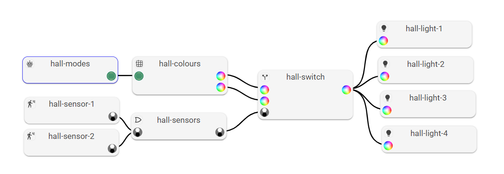

# Ozric Addon for Home Assistant

This is an [add on](https://www.home-assistant.io/addons/) for [Home Assistant](https://www.home-assistant.io/).

## Status

Ozric is currently [alpha](https://en.wikipedia.org/wiki/Software_release_life_cycle#Alpha) quality. Use at your own risk! In particular, no real consideration has been given to security. If your LAN is not trusted, do not use this add on.

## What It Does

By continuously monitoring the states of your various sensors, switches and the environment, Ozric can turn on and off your lights in a very customisable and reactive way.
This logic is customisable and described by a graph, which you can edit visually.

This is very similar to [Node Red](https://nodered.org/), but Ozric is not message-oriented and doesn't need knowledge of YAML. Instead it is entirely GUI based;
the graph is continuously evaluated and responds to internal (computed) state changes as well as sensor changes.

## Compatibility

Ozric is compatible with [HA OS](https://github.com/home-assistant/operating-system) or [HA Supervised](https://github.com/home-assistant/supervised-installer) installations - as these are built on [Docker](https://docker.com) - on 64-bit
Intel/AMD platforms (AMD64) as well as 64-bit ARM (AArch64).

## How To Install It

* Go to the Add Ons repository in your Home Assistant [Add-On Dashboard](http://homeassistant:8123/hassio/dashboard).
* Click on the link at the bottom right to go to the Add On Store.
* From there click "Repositories" in the top right and add the URL [https://github.com/jchown/ozric-addon](https://github.com/jchown/ozric-addon).
* The add-on will then be available to install in the main Add-On Dashboard.
